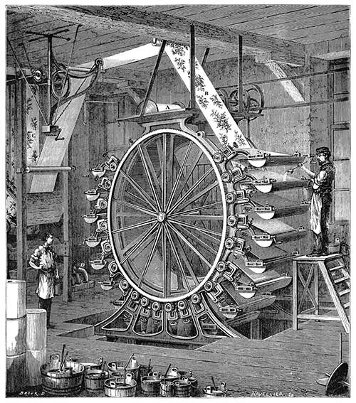

# StempelWerk

_Automatic code generation from Jinja templates_

<figure style="display: flex; flex-flow: column; max-width: 25em;">
  
  <figurecaption>
    <small>
      <em>
        Illustration by Narcisse Navellier (obtained from
        <a href="https://commons.wikimedia.org/wiki/File:Wallpaper-surface-printing-machine.jpg">
          Wikimedia Commons</a>)
      </em>
    </small>
  </figurecaption>
</figure>

## Introduction

StempelWerk has been created to prevent copy-and-paste errors and reduce tedious
manual work. This can lead to a tremendous saving in development time and cost.

Here are some more "selling points":

- the template system is extremely lightweight and easy to understand
- templates can be introduced gradually
- StempelWerk may be removed at any time - simply delete the respective template
  file and edit the code by hand
- templates can undertake surprisingly complex tasks, and StempelWerk can be
  extended using Python
- the template language Jinja2 is very mature and its [Template Designer
  Documentation](https://jinja.palletsprojects.com/en/3.1.x/templates/) of
  excellent quality
- all functionality is covered by unit tests
- permissive licensing:
  - StempelWerk: [BSD 3-Clause License](./LICENSE.md)
  - Jinja2: [BSD 3-Clause License](https://jinja.palletsprojects.com/en/3.1.x/license/)
  - Poetry: [MIT License](https://github.com/python-poetry/poetry/blob/master/LICENSE)
  - Python: [PSF licencse](https://docs.python.org/3/license.html)

### Case study

I have used StempelWerk in a professional project to generate most code (SQL)
and even part of the documentation (Markdown). I offset time gained against time
spent: after nine months, I had saved over 100 hours of working time!

## Installation

_StempelWerk was developed using Python v3.10, so an older version might not
work. The shell scripts that come with StempelWerk assume that you use a virtual
environment and install [poetry](https://python-poetry.org/docs/#installation)
into its default path._

It is recommended to install StempelWerk into a virtual environment. The easiest
way is to run 

```bash
# bash
./script/bootstrap
```

or

```ps1
# PowerShell
.\script\bootstrap.ps1
```

If you need more control over the installation, please read on.

### Virtual environment

Install [poetry](https://python-poetry.org/docs/#installation) and run:

```bash
poetry install --sync
```

This does **not** install the development dependencies. If you need these,
please run:

```bash
poetry install --with dev --sync
```

### Manual installation

Run the following lines to upgrade `pip` and install the dependencies:

```bash
python3 -m pip install --user --upgrade pip

# older versions should work, but will contain security vulnerabilities
python3 -m pip install --user --upgrade "Jinja2>=3.1.3"
```

For development dependencies, please see [pyproject.toml](./pyproject.toml).

## Execution

Generate your code from templates by running the following command:

```bash
python3 -m src.StempelWerk [ARGUMENTS] CONFIG_FILE_PATH
```

For help, simply call:

```bash
python3 -m src.StempelWerk --help
```

### Command line argument `--globals`

Path to a JSON file or a JSON-formatted string containing a dictionary of global
variables: `{"NO_cast": false}`.

Jinja supports several approaches of loading global variables. In case it
matters, StempelWerk loads globals when calling
`jinja2.Environment.get_template`.

_Personally, I am not fond of global variables. I do not want to be obstinate,
however, so I provide a way of using them. But I **do** force you to be explicit
when using globals by grouping them under the variable `globals`. So you'll have
to use `globals.spam` or `globals['spam']` to access the global variable `spam`
you have defined._

_For a simple demonstration of globals, please render the provided example
templates with `--globals '{"NO_cast": true}'`._

### Command line argument `--only-modified`

By default, StempelWerk renders all template files located in the specified
template directory.

When you use the command line argument `--only-modified`, however, StempelWerk
tries to process only the template files that have changed since the last
successful run.

_This logic is not infallible: some file systems update modification times in a
weird manner, and changes to master templates (called "stencils" in StempelWerk)
are currently not handled. However, in such a case you can simply use
StempelWerk without the `--only-modified` argument._

_Use of this command line argument is highly discouraged in CI/CD pipelines!_

### Command line argument `--ultraquiet` and `--quiet`

Adding one of these command line arguments will display less information. Great
when working on slow consoles / VMs.

### Command line argument `--verbose`

Adding this command line argument will display additional information useful for
debugging such as loaded templates and added extensions.

## Settings

Settings for StempelWerk are provided in the form of a JSON file (see
`settings_example.json` for an example) . The path to this file is specified as
command line argument, and is relative to the current working directory.

_For cross-platform compatibility, I recommend to use a forward slash as path
separator on all systems: `/spam/eggs`. StempelWerk will handle all path
separator conversions for you._

### `root_dir`

Path to root directory. All other paths are relative to this directory. This
keeps setting up paths simple, and allows you to call StempelWerk from anywhere.

### `template_dir`

Path to root of template directory, relative to `root_dir`. This directory is
scanned recursively, and all files with an suffix matching the setting
`included_suffixes` will be rendered using Jinja.

### `output_dir`

Path to root of output directory, relative to `root_dir`. Rendered files will be
saved in this directory.

### `stencil_dir_name`

**Default value: None**

Name of the directory that contains stencils (master templates). The name must
not contain slashes or backslashes.

Files in directories matching this name will not be rendered. If this setting is
specified and no stencils are found, StempelWerk will exit with an error.

_There may be one or more directories with this name, and all of them must be
located somewhere under `template_dir`. This ensures that stencils are loaded
into Jinja and can be referenced from templates at runtime._

### `create_directories`

**Default value: False**

StempelWerk automatically creates `template_dir` and `output_dir`. When this
option is set to yes, all missing directories will be created to ensure that
rendered files can be written.

_Depending on your use case, automatically creating directories for output files
may be just awkward or a full-blown security issue. This option is therefore
disabled by default, and it is encouraged to leave it that way._

### `included_suffixes`

List containing suffixes such as `*.sql.jinja`. Only files with a [matching
suffix](https://docs.python.org/3/library/fnmatch.html) are considered to be
templates and will be passed to Jinja.

### `jinja_options`

**Default value: {}**

Dictionary containing [initialization
parameters](https://jinja.palletsprojects.com/api/#jinja2.Environment) for the
Jinja environment.

_Most default values work well for me, but I **always** enable
[`trim_blocks`](https://jinja.palletsprojects.com/en/3.1.x/templates/#whitespace-control):_

```json
  "jinja_options": {
    "trim_blocks": true
  },
```

### `jinja_extensions`

**Default value: []**

List containing Jinja extensions that will be loaded into the Jinja environment.

### `custom_modules`

**Default value: []**

List of Python modules, each containing a `CustomCode` class that inherits
`StempelWerk.CustomCodeTemplate`.

After creating the Jinja environment and loading Jinja extensions, each module
will be imported, an instance of `CustomCode` created and its method
`update_environment()` called. This method must return a Jinja environment.

Use this feature to add filters to the environment, or perform any other task
Python is capable of.

_Warning: there are no security checks to prevent you from deleting all of your
files and doing other mischief, so please be careful!_

### `last_run_file`

**Default value: `.last_run`**

Path to the file in which the time of the last successful run will be stored,
relative to `root_dir`.

_If your operating system handles temporary directories correctly (Windows does
not), you could store this file in one of them (e.g. `/tmp/`). This way, all
template files would be rendered once after starting the system._

### `marker_new_file` and `marker_content`

**Default values: `### New file:` and `### Content:`**

Each time these strings are encountered in the rendered ouput of a template, a
new file is created. This allows you to create multiple files from a single
template.

The code relies on the following order: new file marker, optional whitespace,
path to the output file, optional whitespace, content marker, optional
whitespace, and contents of the output file:

```text
### New file: spam/eggs.py
### Content:
def spam():
    return 'eggs'
```

_Good file separators strike a balance between performance (brevity) and
reliability (uniqueness). Please see the example files to see them in action._

### `newline`

**Default value: `None`**

Rendered files will be written using the operating system's standard newline
character. Change this setting to use another newline character, such as `\r\n`.

_StempelWerk overrides this setting for certain files, such as Windows Batch
files. If you want to change this behavior, please create an instance of
StempelWerk and override its public member variable `newline_exceptions`._

## Code of conduct

Please read the [code of conduct](./CODE_OF_CONDUCT.md) before asking for help,
filing bug reports or contributing to this project. Thanks!

## License

Copyright (c) 2020-2023 [Martin Zuther](https://www.mzuther.de/)

This program is free software and licensed under the terms of the [BSD 3-Clause
License](./LICENSE.md).

**Thank you for using free software!**
